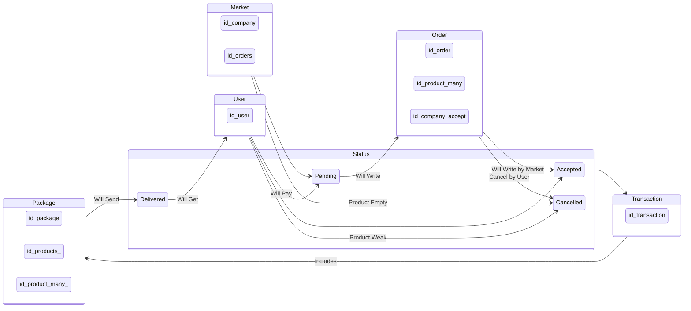

# Transaction Work

```mermaid
stateDiagram-v2 
    direction LR
    
 
    State Package   {
    direction LR

        id_package
        id_products_
        id_product_many_

    }

    State Order   {
    direction LR

        id_order
        id_product_many
        id_company_accept
    }

    State Market   {
    direction LR

        id_company
        id_orders
    }

    state User {
        id_user
    }

    State Transaction {
        id_transaction
    }

    State Status {
   

        Pending
        Accepted
        Delivered
        Cancelled
    }

    ### --- pending
    User --> Pending: Will Pay 
    Market --> Pending
    Pending--> Order: Will Write

    ### --- accept
    User-->Accepted
    ### Order-->Transaction:
    Accepted-->Transaction
    Order-->Accepted: Will Write by Market

    ### --- deliver
    Package-->Delivered:Will Send
    Delivered-->User:Will Get

    ### ---cancel
    Market-->Cancelled:Product Empty
    User-->Cancelled:Product Weak
    Order-->Cancelled:Cancel by User

    ###
    Transaction-->Package : includes
    # Order -->Transaction:Will Write By Market
    # Market-->Order :write
    # User-->Order :buy
    # User-->Transaction :see history
    # Package-->User :Get
 
```
