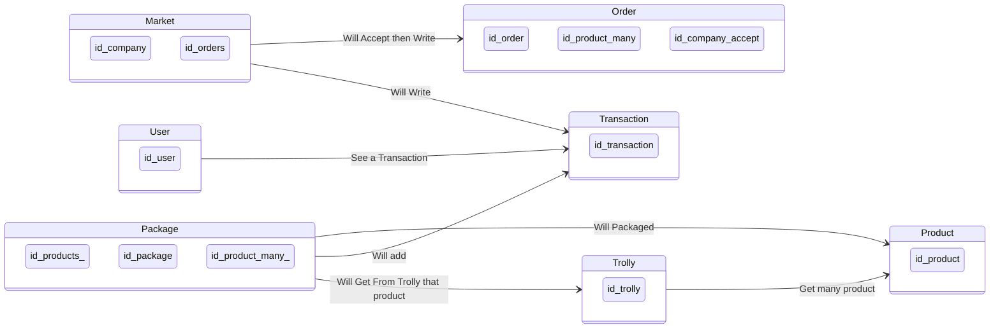

# Transaction Work

```mermaid
stateDiagram-v2 

   state Product {
        id_product 
    }

    State Trolly   {
        id_trolly 
        id_user
        id_products_

    }
       State Package   {
        id_package
        id_products_
        id_product_many_

    }

    State Order   {
        id_order
        id_product_many
        id_company_accept
    }

    State Market   {
        id_company
        id_orders
    }

    state User {
        id_user
    }

    State Transaction {
        id_transaction
    }

 #   State Status {
 #   direction LR
 #       Pending
 #       Accepted
 #       Delivered
 #       Cancelled
 #   }
#
#    ### --- pending
#    User --> Pending:Will Pay
#    Pending--> Order:Will Write
#
#    ### --- accept
#    User-->Accepted
#
#    ### Order-->Transaction:Will Write by Market
#    Market-->Accepted
#    Accepted-->Transaction
#
#    ### --- deliver
#    Product-->Delivered:Will Send
#    Delivered-->User:Will Get
#
#    ### ---cancel
#    Market-->Cancelled:Product Empty
#    User-->Cancelled:Product Weak


    ###
    Market-->Order: Will Accept then Write 
    Market-->Transaction: Will Write 
    ###
    User --> Transaction: See a Transaction
    ###
    Package--> Product : Will Packaged
    Package-->Transaction: Will add 
    Package-->Trolly: Will Get From Trolly that product
    ###
    Trolly-->Product: Get many product
 
```
