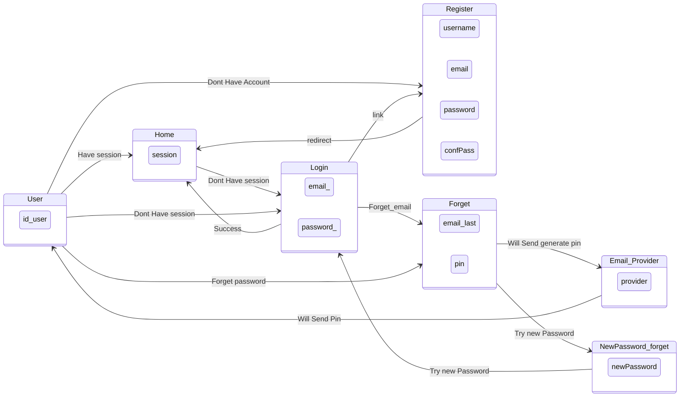

# AUTH Work

```mermaid
stateDiagram-v2 
    direction LR

 
    state User {
        id_user
    }
  
    state Login {
    direction LR

        email_ 
        password_
    }
  
    state Register {
    direction LR

        username
        email
        password
        confPass
    }

    state Home {
        session
    }

    state Forget {
    direction LR

        email_last
        pin
    }


    state Email_Provider {
        provider
    }

    state NewPassword_forget {
        newPassword
    }

    User-->Home:Have session
    Home-->Login:Dont Have session
    User-->Login:Dont Have session
    User -->Register: Dont Have Account

    #-------
    Login-->Register:link
    Login-->Forget:Forget_email
    Login-->Home :Success
    
    #------- register
    Register-->Home : redirect

    #------- forget
    User --> Forget :Forget password
    #
    Forget-->Email_Provider: Will Send generate pin
    Email_Provider-->User: Will Send Pin
    #
    Forget-->NewPassword_forget : Try new Password
    NewPassword_forget-->Login : Try new Password

```
