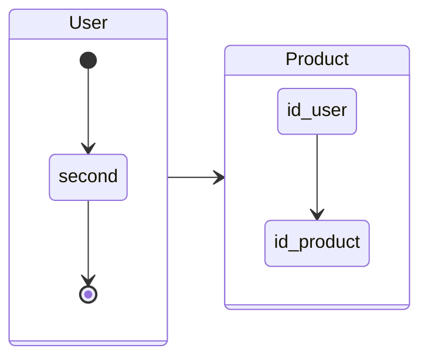
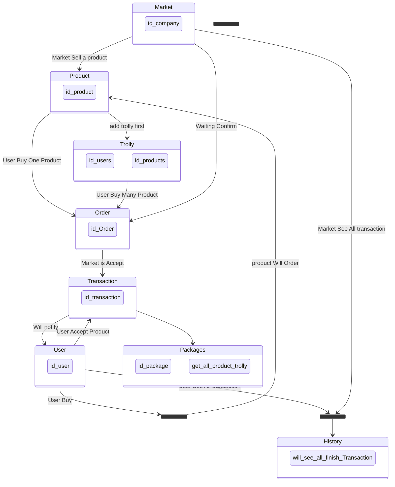
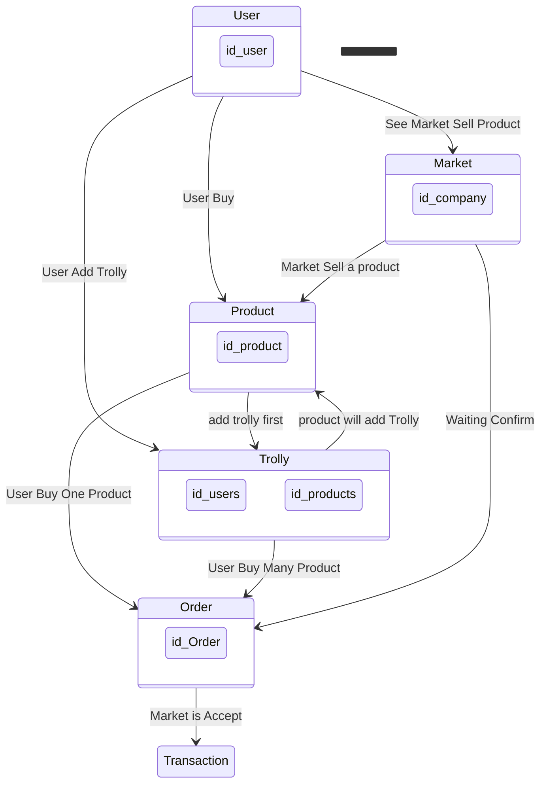
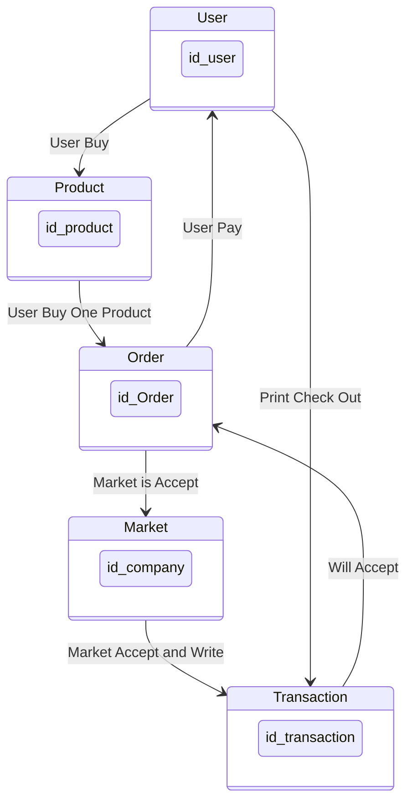
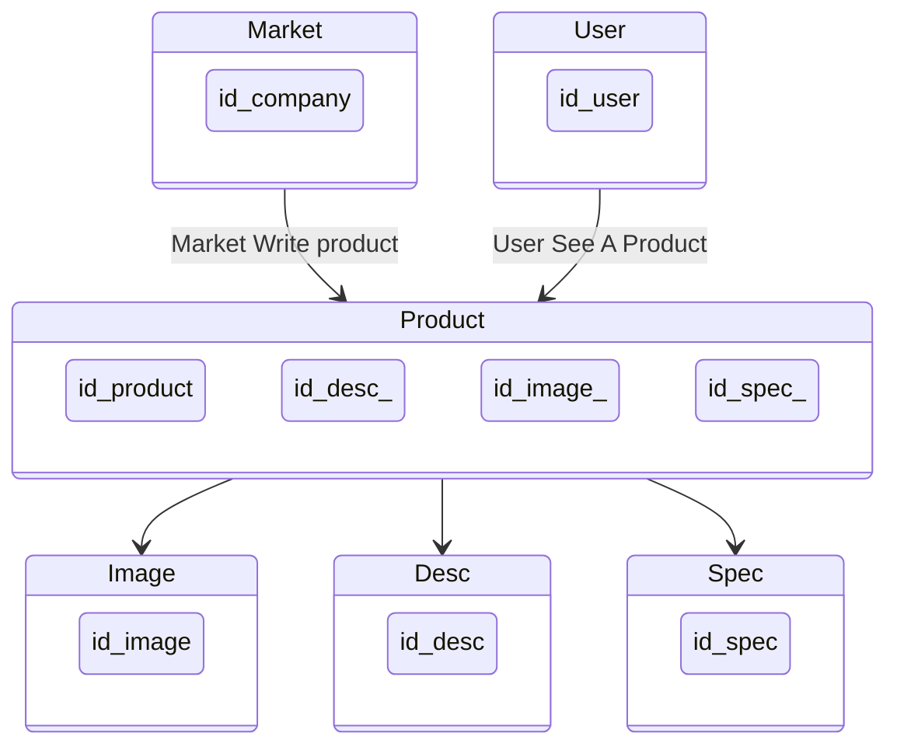
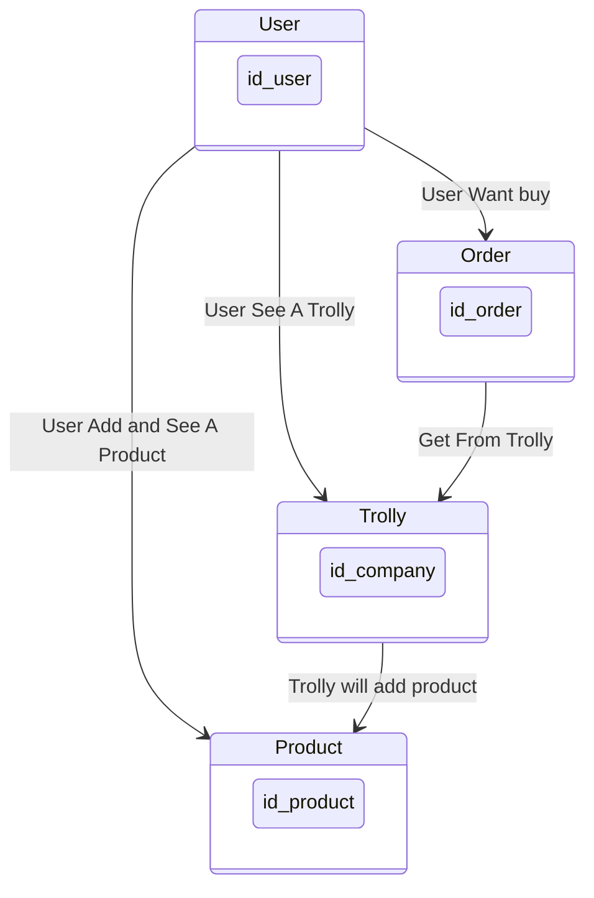
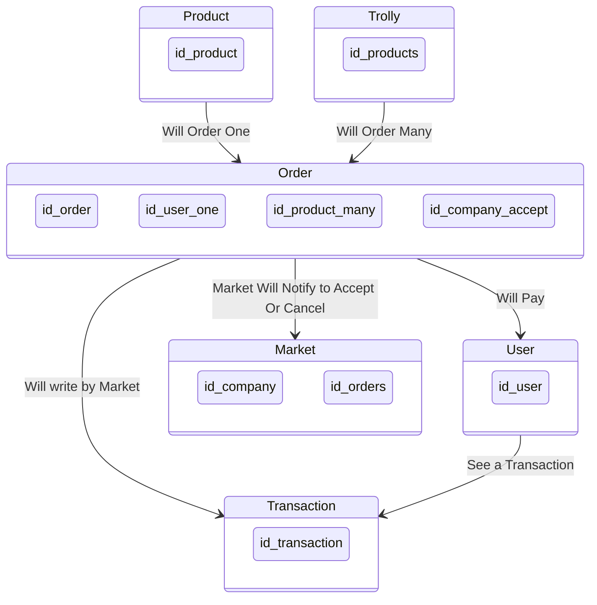

# Example

```mermaid
stateDiagram-v2 
direction LR
    state User {
        [*] --> second
        second --> [*]
    }


    state Product {
        id_user --> id_product
    }
    User --> Product

```

# User Want Buy

```mermaid
stateDiagram-v2 

   State Market   {
        id_company
    }

    state Product {
        id_product 
    }

    state User {
        id_user
    }
    
    state Trolly {
        id_users
        id_products

    }
    
    State Order {
        id_Order
    }

    State Buy <<join>>
    User --> Buy:User Buy
    Buy --> Product : product Will Order

    Market -->Product :Market Sell a product
    Product --> Trolly: add trolly first
    Product --> Order : User Buy One Product
    Trolly --> Order : User Buy Many Product
    Market-->Order :Waiting Confirm
    Order --> Transaction : Market is Accept

    State Transaction_Join <<join>>

    State Transaction{
    id_transaction
    }

    State Packages{
        id_package
        get_all_product_trolly
    }

    Transaction --> Packages
    Transaction --> User : Will notify

    User --> Transaction: User Accept Product

    State End <<join>>

    User --> End : User See All transaction 
    Market --> End : Market See All transaction 
    End --> History 

    State History {
        will_see_all_finish_Transaction
    }
    
 
```

# User Want Buy Schema

```mermaid
stateDiagram-v2 

   State Market   {
        id_company
    }

    state Product {
        id_product 
    }

    state User {
        id_user
    }
    
    state Trolly {
        id_users
        id_products

    }
    
    State Order {
        id_Order
    }


    State Sell <<join>>

    User --> Market: See Market Sell Product 
    User --> Product: User Buy
    User --> Trolly: User Add Trolly
    Trolly --> Product : product will add Trolly

    Market -->Product :Market Sell a product

    Product --> Trolly: add trolly first
    Product --> Order : User Buy One Product
    Trolly --> Order : User Buy Many Product
    Market-->Order :Waiting Confirm
    Order --> Transaction : Market is Accept

 
 
```

# User Want Buy One Product

```mermaid
stateDiagram-v2 
 
    state User {
        id_user
    }
    state Product {
        id_product 
    }

    
    State Order {
        id_Order
    }

    State Market   {
        id_company
    }
    
    State Transaction{
        id_transaction
    }

    User --> Product: User Buy
    Order --> User: User Pay
    Product --> Order : User Buy One Product
    Order --> Market : Market is Accept

    Market --> Transaction :  Market Accept and Write 
    Transaction --> Order : Will Accept
    User --> Transaction: Print Check Out
 
 
```

# Market Sell A Product

```mermaid
stateDiagram-v2 
 
    State Market   {
        id_company
    }

   state Product {
        id_product 
        id_desc_
        id_image_
        id_spec_

    }

    state Image {
        id_image
    }

    state Desc {
        id_desc
    }

    state Spec {
        id_spec
    }

    state User {
        id_user
    }

    Market --> Product :  Market Write product
    Product-->Image
    Product-->Desc
    Product-->Spec
    User --> Product: User See A Product
 
 
```

# Trolly Work

```mermaid
stateDiagram-v2 
 

    state User {
        id_user
    }

   state Product {
        id_product 
    }

    State Trolly   {
        id_company
    }

    State Order   {
        id_order
    }

    User --> Product: User Add and See A Product
    User --> Trolly: User See A Trolly
    Trolly -->  Product: Trolly will add product
    ###
    User -->Order:User Want buy 
    Order --> Trolly:Get From Trolly
 
```

# Order Work

```mermaid
stateDiagram-v2 
   state Product {
        id_product 
    }

    State Trolly   {
        id_user
        id_products

    }

    State Order   {
        id_order
        id_user_one
        id_product_many
        id_company_accept
    }

    State Market   {
        id_company
        id_orders
    }

    state User {
        id_user
    }

    State Transaction{
        id_transaction
    }

    Product -->  Order: Will Order One
    Trolly -->  Order: Will Order Many 
    Order -->  Market: Market Will Notify to Accept Or Cancel
    ###
    Order--> User :Will Pay
    Order --> Transaction: Will write by Market
    User --> Transaction: See a Transaction
 
```
